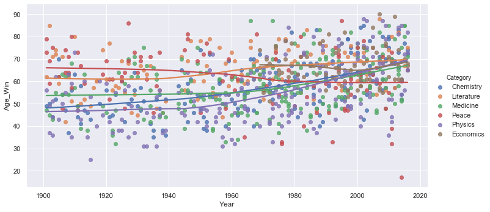

 ## Nobel Prize 


 - Nobel Prize is an international scientific award. It is mostly given to people who had a big contribution in a any filed. The felds are chemistry, literature, physics, medicine, economics, and peace. 
590 Nobel prizes were won by 935 people and organizations. The first prize was given in year 1901 and it is still being awarded till today.

- The dataset used here is taken from https://www.datacamp.com/projects/441


- The webpage for this work : https://reemessam.github.io/Nobel-Prize/


- This dataset was investigated and analyzed to answer the follwing questions:

     - Is there a relation between the organization country and the category of the prize? 
     - Is a specific gender that wins the most prizes?
     - What is the birth country and organization country that has the highest number nobel prize winners ?
     - What is the category that has highest numbe of prizes?
     - What is the average age of the winners?
     - Is there anyone who was awarded the prize more than once?
    
    
- References: 
     - https://en.wikipedia.org/wiki/Nobel_Prize#cite_note-8
     - https://www.kaggle.com/nobelfoundation/nobel-laureates/kernels
     
     
      


## Data Cleaning 

> - #### The first step in the data cleaning phase is reading the data and dropping the duplicated records. 


```python
import pandas as pd
import numpy as np
import scipy.stats as st
import xlrd 
import seaborn as sns
import matplotlib.pyplot as plt
import datetime
%matplotlib inline

data =pd.read_csv("data.csv") 
data= data.drop_duplicates(subset=['Full Name','Year','Laureate ID'])
data.head()

```


<div>
<style scoped>
    .dataframe tbody tr th:only-of-type {
        vertical-align: middle;
    }

    .dataframe tbody tr th {
        vertical-align: top;
    }

    .dataframe thead th {
        text-align: right;
    }
</style>
<table border="1" class="dataframe">
  <thead>
    <tr style="text-align: right;">
      <th></th>
      <th>Year</th>
      <th>Category</th>
      <th>Prize</th>
      <th>Motivation</th>
      <th>Prize Share</th>
      <th>Laureate ID</th>
      <th>Laureate Type</th>
      <th>Full Name</th>
      <th>Birth Date</th>
      <th>Birth City</th>
      <th>Birth Country</th>
      <th>Sex</th>
      <th>Organization Name</th>
      <th>Organization City</th>
      <th>Organization Country</th>
      <th>Death Date</th>
      <th>Death City</th>
      <th>Death Country</th>
      <th>Unnamed: 18</th>
    </tr>
  </thead>
  <tbody>
    <tr>
      <th>0</th>
      <td>1901</td>
      <td>Chemistry</td>
      <td>The Nobel Prize in Chemistry 1901</td>
      <td>"in recognition of the extraordinary services ...</td>
      <td>1-Jan</td>
      <td>160</td>
      <td>Individual</td>
      <td>Jacobus Henricus van 't Hoff</td>
      <td>1852-08-30</td>
      <td>Rotterdam</td>
      <td>Netherlands</td>
      <td>Male</td>
      <td>Berlin University</td>
      <td>Berlin</td>
      <td>Germany</td>
      <td>3/1/1911</td>
      <td>Berlin</td>
      <td>Germany</td>
      <td>NaN</td>
    </tr>
    <tr>
      <th>1</th>
      <td>1901</td>
      <td>Literature</td>
      <td>The Nobel Prize in Literature 1901</td>
      <td>"in special recognition of his poetic composit...</td>
      <td>1-Jan</td>
      <td>569</td>
      <td>Individual</td>
      <td>Sully Prudhomme</td>
      <td>1839-03-16</td>
      <td>Paris</td>
      <td>France</td>
      <td>Male</td>
      <td>NaN</td>
      <td>NaN</td>
      <td>NaN</td>
      <td>9/7/1907</td>
      <td>Châtenay</td>
      <td>France</td>
      <td>NaN</td>
    </tr>
    <tr>
      <th>2</th>
      <td>1901</td>
      <td>Medicine</td>
      <td>The Nobel Prize in Physiology or Medicine 1901</td>
      <td>"for his work on serum therapy, especially its...</td>
      <td>1-Jan</td>
      <td>293</td>
      <td>Individual</td>
      <td>Emil Adolf von Behring</td>
      <td>1854-03-15</td>
      <td>Hansdorf (Lawice)</td>
      <td>Prussia (Poland)</td>
      <td>Male</td>
      <td>Marburg University</td>
      <td>Marburg</td>
      <td>Germany</td>
      <td>3/31/1917</td>
      <td>Marburg</td>
      <td>Germany</td>
      <td>NaN</td>
    </tr>
    <tr>
      <th>3</th>
      <td>1901</td>
      <td>Peace</td>
      <td>The Nobel Peace Prize 1901</td>
      <td>NaN</td>
      <td>2-Jan</td>
      <td>462</td>
      <td>Individual</td>
      <td>Jean Henry Dunant</td>
      <td>1828-05-08</td>
      <td>Geneva</td>
      <td>Switzerland</td>
      <td>Male</td>
      <td>NaN</td>
      <td>NaN</td>
      <td>NaN</td>
      <td>10/30/1910</td>
      <td>Heiden</td>
      <td>Switzerland</td>
      <td>NaN</td>
    </tr>
    <tr>
      <th>4</th>
      <td>1901</td>
      <td>Peace</td>
      <td>The Nobel Peace Prize 1901</td>
      <td>NaN</td>
      <td>2-Jan</td>
      <td>463</td>
      <td>Individual</td>
      <td>Frédéric Passy</td>
      <td>1822-05-20</td>
      <td>Paris</td>
      <td>France</td>
      <td>Male</td>
      <td>NaN</td>
      <td>NaN</td>
      <td>NaN</td>
      <td>6/12/1912</td>
      <td>Paris</td>
      <td>France</td>
      <td>NaN</td>
    </tr>
  </tbody>
</table>
</div>


> - #### There were alot of missing data in the death date, death country, death city features so we fill it manualy through wikipidia.
> - #### The nobel prize winners who are still alive we filled the three features out with "alive" and "not found".
> - #### Then we replaced the death date of "alive" and "not found" people with  the analysis date.


```python
data=data.replace({'Death Date':"alive"},value="11/26/2019",regex=True)
data=data.replace({'Death Date':"not found"},value="11/26/2019",regex=True)
data.head()
```


<div>
<style scoped>
    .dataframe tbody tr th:only-of-type {
        vertical-align: middle;
    }

    .dataframe tbody tr th {
        vertical-align: top;
    }

    .dataframe thead th {
        text-align: right;
    }
</style>
<table border="1" class="dataframe">
  <thead>
    <tr style="text-align: right;">
      <th></th>
      <th>Year</th>
      <th>Category</th>
      <th>Prize</th>
      <th>Motivation</th>
      <th>Prize Share</th>
      <th>Laureate ID</th>
      <th>Laureate Type</th>
      <th>Full Name</th>
      <th>Birth Date</th>
      <th>Birth City</th>
      <th>Birth Country</th>
      <th>Sex</th>
      <th>Organization Name</th>
      <th>Organization City</th>
      <th>Organization Country</th>
      <th>Death Date</th>
      <th>Death City</th>
      <th>Death Country</th>
      <th>Unnamed: 18</th>
    </tr>
  </thead>
  <tbody>
    <tr>
      <th>0</th>
      <td>1901</td>
      <td>Chemistry</td>
      <td>The Nobel Prize in Chemistry 1901</td>
      <td>"in recognition of the extraordinary services ...</td>
      <td>1-Jan</td>
      <td>160</td>
      <td>Individual</td>
      <td>Jacobus Henricus van 't Hoff</td>
      <td>1852-08-30</td>
      <td>Rotterdam</td>
      <td>Netherlands</td>
      <td>Male</td>
      <td>Berlin University</td>
      <td>Berlin</td>
      <td>Germany</td>
      <td>3/1/1911</td>
      <td>Berlin</td>
      <td>Germany</td>
      <td>NaN</td>
    </tr>
    <tr>
      <th>1</th>
      <td>1901</td>
      <td>Literature</td>
      <td>The Nobel Prize in Literature 1901</td>
      <td>"in special recognition of his poetic composit...</td>
      <td>1-Jan</td>
      <td>569</td>
      <td>Individual</td>
      <td>Sully Prudhomme</td>
      <td>1839-03-16</td>
      <td>Paris</td>
      <td>France</td>
      <td>Male</td>
      <td>NaN</td>
      <td>NaN</td>
      <td>NaN</td>
      <td>9/7/1907</td>
      <td>Châtenay</td>
      <td>France</td>
      <td>NaN</td>
    </tr>
    <tr>
      <th>2</th>
      <td>1901</td>
      <td>Medicine</td>
      <td>The Nobel Prize in Physiology or Medicine 1901</td>
      <td>"for his work on serum therapy, especially its...</td>
      <td>1-Jan</td>
      <td>293</td>
      <td>Individual</td>
      <td>Emil Adolf von Behring</td>
      <td>1854-03-15</td>
      <td>Hansdorf (Lawice)</td>
      <td>Prussia (Poland)</td>
      <td>Male</td>
      <td>Marburg University</td>
      <td>Marburg</td>
      <td>Germany</td>
      <td>3/31/1917</td>
      <td>Marburg</td>
      <td>Germany</td>
      <td>NaN</td>
    </tr>
    <tr>
      <th>3</th>
      <td>1901</td>
      <td>Peace</td>
      <td>The Nobel Peace Prize 1901</td>
      <td>NaN</td>
      <td>2-Jan</td>
      <td>462</td>
      <td>Individual</td>
      <td>Jean Henry Dunant</td>
      <td>1828-05-08</td>
      <td>Geneva</td>
      <td>Switzerland</td>
      <td>Male</td>
      <td>NaN</td>
      <td>NaN</td>
      <td>NaN</td>
      <td>10/30/1910</td>
      <td>Heiden</td>
      <td>Switzerland</td>
      <td>NaN</td>
    </tr>
    <tr>
      <th>4</th>
      <td>1901</td>
      <td>Peace</td>
      <td>The Nobel Peace Prize 1901</td>
      <td>NaN</td>
      <td>2-Jan</td>
      <td>463</td>
      <td>Individual</td>
      <td>Frédéric Passy</td>
      <td>1822-05-20</td>
      <td>Paris</td>
      <td>France</td>
      <td>Male</td>
      <td>NaN</td>
      <td>NaN</td>
      <td>NaN</td>
      <td>6/12/1912</td>
      <td>Paris</td>
      <td>France</td>
      <td>NaN</td>
    </tr>
  </tbody>
</table>
</div>


> - #### We found out that the number of organiztions that won nobel prize is between 2% and 3% and they are not important for our analysis so they were dropped. 


```python
data = data[data["Laureate Type"] != 'Organization']
data=data.reset_index(drop=True)
data.head()

```


<div>
<style scoped>
    .dataframe tbody tr th:only-of-type {
        vertical-align: middle;
    }

    .dataframe tbody tr th {
        vertical-align: top;
    }

    .dataframe thead th {
        text-align: right;
    }
</style>
<table border="1" class="dataframe">
  <thead>
    <tr style="text-align: right;">
      <th></th>
      <th>Year</th>
      <th>Category</th>
      <th>Prize</th>
      <th>Motivation</th>
      <th>Prize Share</th>
      <th>Laureate ID</th>
      <th>Laureate Type</th>
      <th>Full Name</th>
      <th>Birth Date</th>
      <th>Birth City</th>
      <th>Birth Country</th>
      <th>Sex</th>
      <th>Organization Name</th>
      <th>Organization City</th>
      <th>Organization Country</th>
      <th>Death Date</th>
      <th>Death City</th>
      <th>Death Country</th>
      <th>Unnamed: 18</th>
    </tr>
  </thead>
  <tbody>
    <tr>
      <th>0</th>
      <td>1901</td>
      <td>Chemistry</td>
      <td>The Nobel Prize in Chemistry 1901</td>
      <td>"in recognition of the extraordinary services ...</td>
      <td>1-Jan</td>
      <td>160</td>
      <td>Individual</td>
      <td>Jacobus Henricus van 't Hoff</td>
      <td>1852-08-30</td>
      <td>Rotterdam</td>
      <td>Netherlands</td>
      <td>Male</td>
      <td>Berlin University</td>
      <td>Berlin</td>
      <td>Germany</td>
      <td>3/1/1911</td>
      <td>Berlin</td>
      <td>Germany</td>
      <td>NaN</td>
    </tr>
    <tr>
      <th>1</th>
      <td>1901</td>
      <td>Literature</td>
      <td>The Nobel Prize in Literature 1901</td>
      <td>"in special recognition of his poetic composit...</td>
      <td>1-Jan</td>
      <td>569</td>
      <td>Individual</td>
      <td>Sully Prudhomme</td>
      <td>1839-03-16</td>
      <td>Paris</td>
      <td>France</td>
      <td>Male</td>
      <td>NaN</td>
      <td>NaN</td>
      <td>NaN</td>
      <td>9/7/1907</td>
      <td>Châtenay</td>
      <td>France</td>
      <td>NaN</td>
    </tr>
    <tr>
      <th>2</th>
      <td>1901</td>
      <td>Medicine</td>
      <td>The Nobel Prize in Physiology or Medicine 1901</td>
      <td>"for his work on serum therapy, especially its...</td>
      <td>1-Jan</td>
      <td>293</td>
      <td>Individual</td>
      <td>Emil Adolf von Behring</td>
      <td>1854-03-15</td>
      <td>Hansdorf (Lawice)</td>
      <td>Prussia (Poland)</td>
      <td>Male</td>
      <td>Marburg University</td>
      <td>Marburg</td>
      <td>Germany</td>
      <td>3/31/1917</td>
      <td>Marburg</td>
      <td>Germany</td>
      <td>NaN</td>
    </tr>
    <tr>
      <th>3</th>
      <td>1901</td>
      <td>Peace</td>
      <td>The Nobel Peace Prize 1901</td>
      <td>NaN</td>
      <td>2-Jan</td>
      <td>462</td>
      <td>Individual</td>
      <td>Jean Henry Dunant</td>
      <td>1828-05-08</td>
      <td>Geneva</td>
      <td>Switzerland</td>
      <td>Male</td>
      <td>NaN</td>
      <td>NaN</td>
      <td>NaN</td>
      <td>10/30/1910</td>
      <td>Heiden</td>
      <td>Switzerland</td>
      <td>NaN</td>
    </tr>
    <tr>
      <th>4</th>
      <td>1901</td>
      <td>Peace</td>
      <td>The Nobel Peace Prize 1901</td>
      <td>NaN</td>
      <td>2-Jan</td>
      <td>463</td>
      <td>Individual</td>
      <td>Frédéric Passy</td>
      <td>1822-05-20</td>
      <td>Paris</td>
      <td>France</td>
      <td>Male</td>
      <td>NaN</td>
      <td>NaN</td>
      <td>NaN</td>
      <td>6/12/1912</td>
      <td>Paris</td>
      <td>France</td>
      <td>NaN</td>
    </tr>
  </tbody>
</table>
</div>


> - #### We were interested in the age of nobel prize winners when they were awarded the prize so we combuted it using the birth date and the year columns and then they were dropped.
> - #### In the same way we computed nobel prize winners current age using the birth date and the death date columns and then they were dropped.
> - #### We also dropped unused columns ("Motivation","Prize","Laureate Type,"Laureate ID")


```python
data['Birth Year']= data["Birth Date"].str.extract("(\d{4})", expand=False)  
data['Death Year']= data["Death Date"].str.extract("(\d{4})", expand=False)  
data["Age"]=-data['Birth Year'].astype('int')+data["Death Year"].astype('int')
data["Age_Win"]=-data['Birth Year'].astype('int')+data["Year"].astype('int')
data.drop(['Death City', 'Death Country',"Birth Date","Death Date","Birth Year","Death Year","Motivation","Prize","Laureate Type","Laureate ID"], axis = 1,inplace = True)
data.drop(['Unnamed: 18'], axis = 1,inplace = True)
data.head()

```


<div>
<style scoped>
    .dataframe tbody tr th:only-of-type {
        vertical-align: middle;
    }

    .dataframe tbody tr th {
        vertical-align: top;
    }

    .dataframe thead th {
        text-align: right;
    }
</style>
<table border="1" class="dataframe">
  <thead>
    <tr style="text-align: right;">
      <th></th>
      <th>Year</th>
      <th>Category</th>
      <th>Prize Share</th>
      <th>Full Name</th>
      <th>Birth City</th>
      <th>Birth Country</th>
      <th>Sex</th>
      <th>Organization Name</th>
      <th>Organization City</th>
      <th>Organization Country</th>
      <th>Age</th>
      <th>Age_Win</th>
    </tr>
  </thead>
  <tbody>
    <tr>
      <th>0</th>
      <td>1901</td>
      <td>Chemistry</td>
      <td>1-Jan</td>
      <td>Jacobus Henricus van 't Hoff</td>
      <td>Rotterdam</td>
      <td>Netherlands</td>
      <td>Male</td>
      <td>Berlin University</td>
      <td>Berlin</td>
      <td>Germany</td>
      <td>59</td>
      <td>49</td>
    </tr>
    <tr>
      <th>1</th>
      <td>1901</td>
      <td>Literature</td>
      <td>1-Jan</td>
      <td>Sully Prudhomme</td>
      <td>Paris</td>
      <td>France</td>
      <td>Male</td>
      <td>NaN</td>
      <td>NaN</td>
      <td>NaN</td>
      <td>68</td>
      <td>62</td>
    </tr>
    <tr>
      <th>2</th>
      <td>1901</td>
      <td>Medicine</td>
      <td>1-Jan</td>
      <td>Emil Adolf von Behring</td>
      <td>Hansdorf (Lawice)</td>
      <td>Prussia (Poland)</td>
      <td>Male</td>
      <td>Marburg University</td>
      <td>Marburg</td>
      <td>Germany</td>
      <td>63</td>
      <td>47</td>
    </tr>
    <tr>
      <th>3</th>
      <td>1901</td>
      <td>Peace</td>
      <td>2-Jan</td>
      <td>Jean Henry Dunant</td>
      <td>Geneva</td>
      <td>Switzerland</td>
      <td>Male</td>
      <td>NaN</td>
      <td>NaN</td>
      <td>NaN</td>
      <td>82</td>
      <td>73</td>
    </tr>
    <tr>
      <th>4</th>
      <td>1901</td>
      <td>Peace</td>
      <td>2-Jan</td>
      <td>Frédéric Passy</td>
      <td>Paris</td>
      <td>France</td>
      <td>Male</td>
      <td>NaN</td>
      <td>NaN</td>
      <td>NaN</td>
      <td>90</td>
      <td>79</td>
    </tr>
  </tbody>
</table>
</div>


> - #### After investigating the "Birth Country" column, it was found that some countries had both their historical names and theri current names.We were only interested in the current name. In this case the current name was between brackes "( )". So we used a regular expression to extract the name between the brackets.

>- #### After that the missing values in the  "Organization Country" columns were filled. The values used to fill the missing values are the following:
  - #####  First the records were grouped by the "Birth Country".
  -  ##### After that for each "Birth Country" value, The most repeated "Organization Country" value was chosen for filling the missing values.


```python
data['Birth Country']= data['Birth Country'].str.replace(r'[^(]*\(|\)[^)]*', '')
d=data.groupby('Birth Country')["Organization Country"].apply(lambda x: st.mode(x)[0][0])
d=d[data['Birth Country']]
d_null=data['Organization Country'].isnull()
data.eq(0).any()
for i in range(0,data['Birth Country'].size):
    
    if(d_null[i]):
        if(d[i]==0):
            data.iat[i,9] =data['Birth Country'][i] 
        else:
            data.iat[i,9] =d[i]

data.to_csv("new_data.csv")
data.head()
```


<div>
<style scoped>
    .dataframe tbody tr th:only-of-type {
        vertical-align: middle;
    }

    .dataframe tbody tr th {
        vertical-align: top;
    }

    .dataframe thead th {
        text-align: right;
    }
</style>
<table border="1" class="dataframe">
  <thead>
    <tr style="text-align: right;">
      <th></th>
      <th>Year</th>
      <th>Category</th>
      <th>Prize Share</th>
      <th>Full Name</th>
      <th>Birth City</th>
      <th>Birth Country</th>
      <th>Sex</th>
      <th>Organization Name</th>
      <th>Organization City</th>
      <th>Organization Country</th>
      <th>Age</th>
      <th>Age_Win</th>
    </tr>
  </thead>
  <tbody>
    <tr>
      <th>0</th>
      <td>1901</td>
      <td>Chemistry</td>
      <td>1-Jan</td>
      <td>Jacobus Henricus van 't Hoff</td>
      <td>Rotterdam</td>
      <td>Netherlands</td>
      <td>Male</td>
      <td>Berlin University</td>
      <td>Berlin</td>
      <td>Germany</td>
      <td>59</td>
      <td>49</td>
    </tr>
    <tr>
      <th>1</th>
      <td>1901</td>
      <td>Literature</td>
      <td>1-Jan</td>
      <td>Sully Prudhomme</td>
      <td>Paris</td>
      <td>France</td>
      <td>Male</td>
      <td>NaN</td>
      <td>NaN</td>
      <td>France</td>
      <td>68</td>
      <td>62</td>
    </tr>
    <tr>
      <th>2</th>
      <td>1901</td>
      <td>Medicine</td>
      <td>1-Jan</td>
      <td>Emil Adolf von Behring</td>
      <td>Hansdorf (Lawice)</td>
      <td>Poland</td>
      <td>Male</td>
      <td>Marburg University</td>
      <td>Marburg</td>
      <td>Germany</td>
      <td>63</td>
      <td>47</td>
    </tr>
    <tr>
      <th>3</th>
      <td>1901</td>
      <td>Peace</td>
      <td>2-Jan</td>
      <td>Jean Henry Dunant</td>
      <td>Geneva</td>
      <td>Switzerland</td>
      <td>Male</td>
      <td>NaN</td>
      <td>NaN</td>
      <td>Switzerland</td>
      <td>82</td>
      <td>73</td>
    </tr>
    <tr>
      <th>4</th>
      <td>1901</td>
      <td>Peace</td>
      <td>2-Jan</td>
      <td>Frédéric Passy</td>
      <td>Paris</td>
      <td>France</td>
      <td>Male</td>
      <td>NaN</td>
      <td>NaN</td>
      <td>France</td>
      <td>90</td>
      <td>79</td>
    </tr>
  </tbody>
</table>
</div>


## Exploratory analysis and visualizations

 > ### Statistics of the data


```python
data.describe()

```


<div>
<style scoped>
    .dataframe tbody tr th:only-of-type {
        vertical-align: middle;
    }

    .dataframe tbody tr th {
        vertical-align: top;
    }

    .dataframe thead th {
        text-align: right;
    }
</style>
<table border="1" class="dataframe">
  <thead>
    <tr style="text-align: right;">
      <th></th>
      <th>Year</th>
      <th>Age</th>
      <th>Age_Win</th>
    </tr>
  </thead>
  <tbody>
    <tr>
      <th>count</th>
      <td>882.000000</td>
      <td>882.000000</td>
      <td>882.000000</td>
    </tr>
    <tr>
      <th>mean</th>
      <td>1969.047619</td>
      <td>79.411565</td>
      <td>59.434240</td>
    </tr>
    <tr>
      <th>std</th>
      <td>32.894873</td>
      <td>10.911761</td>
      <td>12.403301</td>
    </tr>
    <tr>
      <th>min</th>
      <td>1901.000000</td>
      <td>22.000000</td>
      <td>17.000000</td>
    </tr>
    <tr>
      <th>25%</th>
      <td>1946.000000</td>
      <td>73.000000</td>
      <td>50.000000</td>
    </tr>
    <tr>
      <th>50%</th>
      <td>1975.000000</td>
      <td>80.000000</td>
      <td>60.000000</td>
    </tr>
    <tr>
      <th>75%</th>
      <td>1997.000000</td>
      <td>87.750000</td>
      <td>69.000000</td>
    </tr>
    <tr>
      <th>max</th>
      <td>2016.000000</td>
      <td>103.000000</td>
      <td>90.000000</td>
    </tr>
  </tbody>
</table>
</div>


> ### Current age distribution


```python
sns.distplot(data.Age, bins=35)
sns.set(rc={"figure.figsize": (10, 5)})
```


> ### The distribution of the age when the nobel prize was earned


```python
sns.distplot(data.Age_Win, bins=35)
sns.set(rc={"figure.figsize": (10, 5)})
```


> ### The distribution of the categories and their counts


```python
sns.countplot(y="Category", data=data,order=data.Category.value_counts().index,palette='deep')
sns.despine();
data['Category'].value_counts()
```


    Medicine      211
    Physics       204
    Chemistry     175
    Literature    113
    Peace         101
    Economics      78
    Name: Category, dtype: int64


> ### Gender Distribution 


```python
sns.countplot(x="Sex", data=data, palette='GnBu_d')
sns.despine();
data['Sex'].value_counts()
```


    Male      834
    Female     48
    Name: Sex, dtype: int64


> ### Organization Country Counts


```python
data['Organization Country'].value_counts()
```


    United States of America               414
    United Kingdom                         112
    Germany                                 58
    France                                  58
    Sweden                                  32
    Switzerland                             26
    Federal Republic of Germany             23
    Japan                                   19
    Union of Soviet Socialist Republics     16
    Denmark                                 13
    Netherlands                             12
    Belgium                                  9
    Norway                                   9
    Italy                                    7
    Canada                                   7
    Israel                                   6
    Austria                                  6
    Australia                                5
    Northern Ireland                         5
    Ireland                                  4
    Russia                                   3
    Iran                                     2
    Guatemala                                2
    Portugal                                 2
    Liberia                                  2
    Colombia                                 2
    East Timor                               2
    Argentina                                2
    Chile                                    2
    China                                    1
    Zimbabwe                                 1
    Alsace (then Germany, now France)        1
    Costa Rica                               1
    Bulgaria                                 1
    Guadeloupe Island                        1
    Yemen                                    1
    Czechoslovakia                           1
    Ghana                                    1
    Trinidad                                 1
    Nigeria                                  1
    Myanmar                                  1
    India                                    1
    Hungary                                  1
    Iceland                                  1
    Peru                                     1
    Kenya                                    1
    Spain                                    1
    Bangladesh                               1
    Finland                                  1
    Madagascar                               1
    Greece                                   1
    Name: Organization Country, dtype: int64


> ### Organization Country Distribution 


```python
sns.countplot(y="Organization Country", data=data,order=data["Organization Country"].value_counts().index,palette='deep')
sns.set(rc={"figure.figsize": (15, 12)})
```


> ### Birth Country Distribution


```python
sns.countplot(y="Birth Country", data=data,order=data["Birth Country"].value_counts().head(30).index,palette='deep')
sns.set(rc={"figure.figsize": (15, 12)})
```


> ### Corelation analysis between the organization country and the category
   - #### In this part we are studying if there is a relaton between the organization country and the category by doing a chi-squre test.


```python
contengency_table = pd.crosstab(data["Category"],data["Organization Country"], margins= False)
contengency_table
```


<div>
<style scoped>
    .dataframe tbody tr th:only-of-type {
        vertical-align: middle;
    }

    .dataframe tbody tr th {
        vertical-align: top;
    }

    .dataframe thead th {
        text-align: right;
    }
</style>
<table border="1" class="dataframe">
  <thead>
    <tr style="text-align: right;">
      <th>Organization Country</th>
      <th>Alsace (then Germany, now France)</th>
      <th>Argentina</th>
      <th>Australia</th>
      <th>Austria</th>
      <th>Bangladesh</th>
      <th>Belgium</th>
      <th>Bulgaria</th>
      <th>Canada</th>
      <th>Chile</th>
      <th>China</th>
      <th>...</th>
      <th>Russia</th>
      <th>Spain</th>
      <th>Sweden</th>
      <th>Switzerland</th>
      <th>Trinidad</th>
      <th>Union of Soviet Socialist Republics</th>
      <th>United Kingdom</th>
      <th>United States of America</th>
      <th>Yemen</th>
      <th>Zimbabwe</th>
    </tr>
    <tr>
      <th>Category</th>
      <th></th>
      <th></th>
      <th></th>
      <th></th>
      <th></th>
      <th></th>
      <th></th>
      <th></th>
      <th></th>
      <th></th>
      <th></th>
      <th></th>
      <th></th>
      <th></th>
      <th></th>
      <th></th>
      <th></th>
      <th></th>
      <th></th>
      <th></th>
      <th></th>
    </tr>
  </thead>
  <tbody>
    <tr>
      <th>Chemistry</th>
      <td>0</td>
      <td>1</td>
      <td>0</td>
      <td>1</td>
      <td>0</td>
      <td>1</td>
      <td>0</td>
      <td>3</td>
      <td>0</td>
      <td>0</td>
      <td>...</td>
      <td>0</td>
      <td>0</td>
      <td>5</td>
      <td>6</td>
      <td>0</td>
      <td>1</td>
      <td>27</td>
      <td>74</td>
      <td>0</td>
      <td>0</td>
    </tr>
    <tr>
      <th>Economics</th>
      <td>0</td>
      <td>0</td>
      <td>0</td>
      <td>0</td>
      <td>0</td>
      <td>0</td>
      <td>0</td>
      <td>0</td>
      <td>0</td>
      <td>0</td>
      <td>...</td>
      <td>0</td>
      <td>0</td>
      <td>2</td>
      <td>0</td>
      <td>0</td>
      <td>1</td>
      <td>6</td>
      <td>62</td>
      <td>0</td>
      <td>0</td>
    </tr>
    <tr>
      <th>Literature</th>
      <td>0</td>
      <td>0</td>
      <td>0</td>
      <td>0</td>
      <td>0</td>
      <td>1</td>
      <td>1</td>
      <td>0</td>
      <td>2</td>
      <td>0</td>
      <td>...</td>
      <td>0</td>
      <td>0</td>
      <td>8</td>
      <td>2</td>
      <td>1</td>
      <td>5</td>
      <td>10</td>
      <td>40</td>
      <td>0</td>
      <td>0</td>
    </tr>
    <tr>
      <th>Medicine</th>
      <td>0</td>
      <td>1</td>
      <td>4</td>
      <td>4</td>
      <td>0</td>
      <td>3</td>
      <td>0</td>
      <td>2</td>
      <td>0</td>
      <td>1</td>
      <td>...</td>
      <td>1</td>
      <td>1</td>
      <td>7</td>
      <td>8</td>
      <td>0</td>
      <td>0</td>
      <td>31</td>
      <td>106</td>
      <td>0</td>
      <td>0</td>
    </tr>
    <tr>
      <th>Peace</th>
      <td>0</td>
      <td>0</td>
      <td>0</td>
      <td>0</td>
      <td>1</td>
      <td>3</td>
      <td>0</td>
      <td>0</td>
      <td>0</td>
      <td>0</td>
      <td>...</td>
      <td>0</td>
      <td>0</td>
      <td>6</td>
      <td>3</td>
      <td>0</td>
      <td>2</td>
      <td>13</td>
      <td>33</td>
      <td>1</td>
      <td>1</td>
    </tr>
    <tr>
      <th>Physics</th>
      <td>1</td>
      <td>0</td>
      <td>1</td>
      <td>1</td>
      <td>0</td>
      <td>1</td>
      <td>0</td>
      <td>2</td>
      <td>0</td>
      <td>0</td>
      <td>...</td>
      <td>2</td>
      <td>0</td>
      <td>4</td>
      <td>7</td>
      <td>0</td>
      <td>7</td>
      <td>25</td>
      <td>99</td>
      <td>0</td>
      <td>0</td>
    </tr>
  </tbody>
</table>
<p>6 rows × 51 columns</p>
</div>


>- #### From the above table it is shown that the USA is top country in all the categories followed by the UK 


```python
st.chi2_contingency(contengency_table)
```


    (402.6301361678153,
     3.0198785171582588e-09,
     250,
     array([[1.98412698e-01, 3.96825397e-01, 9.92063492e-01, 1.19047619e+00,
             1.98412698e-01, 1.78571429e+00, 1.98412698e-01, 1.38888889e+00,
             3.96825397e-01, 1.98412698e-01, 3.96825397e-01, 1.98412698e-01,
             1.98412698e-01, 2.57936508e+00, 3.96825397e-01, 4.56349206e+00,
             1.98412698e-01, 1.15079365e+01, 1.15079365e+01, 1.98412698e-01,
             1.98412698e-01, 1.98412698e-01, 3.96825397e-01, 1.98412698e-01,
             1.98412698e-01, 1.98412698e-01, 3.96825397e-01, 7.93650794e-01,
             1.19047619e+00, 1.38888889e+00, 3.76984127e+00, 1.98412698e-01,
             3.96825397e-01, 1.98412698e-01, 1.98412698e-01, 2.38095238e+00,
             1.98412698e-01, 9.92063492e-01, 1.78571429e+00, 1.98412698e-01,
             3.96825397e-01, 5.95238095e-01, 1.98412698e-01, 6.34920635e+00,
             5.15873016e+00, 1.98412698e-01, 3.17460317e+00, 2.22222222e+01,
             8.21428571e+01, 1.98412698e-01, 1.98412698e-01],
            [8.84353741e-02, 1.76870748e-01, 4.42176871e-01, 5.30612245e-01,
             8.84353741e-02, 7.95918367e-01, 8.84353741e-02, 6.19047619e-01,
             1.76870748e-01, 8.84353741e-02, 1.76870748e-01, 8.84353741e-02,
             8.84353741e-02, 1.14965986e+00, 1.76870748e-01, 2.03401361e+00,
             8.84353741e-02, 5.12925170e+00, 5.12925170e+00, 8.84353741e-02,
             8.84353741e-02, 8.84353741e-02, 1.76870748e-01, 8.84353741e-02,
             8.84353741e-02, 8.84353741e-02, 1.76870748e-01, 3.53741497e-01,
             5.30612245e-01, 6.19047619e-01, 1.68027211e+00, 8.84353741e-02,
             1.76870748e-01, 8.84353741e-02, 8.84353741e-02, 1.06122449e+00,
             8.84353741e-02, 4.42176871e-01, 7.95918367e-01, 8.84353741e-02,
             1.76870748e-01, 2.65306122e-01, 8.84353741e-02, 2.82993197e+00,
             2.29931973e+00, 8.84353741e-02, 1.41496599e+00, 9.90476190e+00,
             3.66122449e+01, 8.84353741e-02, 8.84353741e-02],
            [1.28117914e-01, 2.56235828e-01, 6.40589569e-01, 7.68707483e-01,
             1.28117914e-01, 1.15306122e+00, 1.28117914e-01, 8.96825397e-01,
             2.56235828e-01, 1.28117914e-01, 2.56235828e-01, 1.28117914e-01,
             1.28117914e-01, 1.66553288e+00, 2.56235828e-01, 2.94671202e+00,
             1.28117914e-01, 7.43083900e+00, 7.43083900e+00, 1.28117914e-01,
             1.28117914e-01, 1.28117914e-01, 2.56235828e-01, 1.28117914e-01,
             1.28117914e-01, 1.28117914e-01, 2.56235828e-01, 5.12471655e-01,
             7.68707483e-01, 8.96825397e-01, 2.43424036e+00, 1.28117914e-01,
             2.56235828e-01, 1.28117914e-01, 1.28117914e-01, 1.53741497e+00,
             1.28117914e-01, 6.40589569e-01, 1.15306122e+00, 1.28117914e-01,
             2.56235828e-01, 3.84353741e-01, 1.28117914e-01, 4.09977324e+00,
             3.33106576e+00, 1.28117914e-01, 2.04988662e+00, 1.43492063e+01,
             5.30408163e+01, 1.28117914e-01, 1.28117914e-01],
            [2.39229025e-01, 4.78458050e-01, 1.19614512e+00, 1.43537415e+00,
             2.39229025e-01, 2.15306122e+00, 2.39229025e-01, 1.67460317e+00,
             4.78458050e-01, 2.39229025e-01, 4.78458050e-01, 2.39229025e-01,
             2.39229025e-01, 3.10997732e+00, 4.78458050e-01, 5.50226757e+00,
             2.39229025e-01, 1.38752834e+01, 1.38752834e+01, 2.39229025e-01,
             2.39229025e-01, 2.39229025e-01, 4.78458050e-01, 2.39229025e-01,
             2.39229025e-01, 2.39229025e-01, 4.78458050e-01, 9.56916100e-01,
             1.43537415e+00, 1.67460317e+00, 4.54535147e+00, 2.39229025e-01,
             4.78458050e-01, 2.39229025e-01, 2.39229025e-01, 2.87074830e+00,
             2.39229025e-01, 1.19614512e+00, 2.15306122e+00, 2.39229025e-01,
             4.78458050e-01, 7.17687075e-01, 2.39229025e-01, 7.65532880e+00,
             6.21995465e+00, 2.39229025e-01, 3.82766440e+00, 2.67936508e+01,
             9.90408163e+01, 2.39229025e-01, 2.39229025e-01],
            [1.14512472e-01, 2.29024943e-01, 5.72562358e-01, 6.87074830e-01,
             1.14512472e-01, 1.03061224e+00, 1.14512472e-01, 8.01587302e-01,
             2.29024943e-01, 1.14512472e-01, 2.29024943e-01, 1.14512472e-01,
             1.14512472e-01, 1.48866213e+00, 2.29024943e-01, 2.63378685e+00,
             1.14512472e-01, 6.64172336e+00, 6.64172336e+00, 1.14512472e-01,
             1.14512472e-01, 1.14512472e-01, 2.29024943e-01, 1.14512472e-01,
             1.14512472e-01, 1.14512472e-01, 2.29024943e-01, 4.58049887e-01,
             6.87074830e-01, 8.01587302e-01, 2.17573696e+00, 1.14512472e-01,
             2.29024943e-01, 1.14512472e-01, 1.14512472e-01, 1.37414966e+00,
             1.14512472e-01, 5.72562358e-01, 1.03061224e+00, 1.14512472e-01,
             2.29024943e-01, 3.43537415e-01, 1.14512472e-01, 3.66439909e+00,
             2.97732426e+00, 1.14512472e-01, 1.83219955e+00, 1.28253968e+01,
             4.74081633e+01, 1.14512472e-01, 1.14512472e-01],
            [2.31292517e-01, 4.62585034e-01, 1.15646259e+00, 1.38775510e+00,
             2.31292517e-01, 2.08163265e+00, 2.31292517e-01, 1.61904762e+00,
             4.62585034e-01, 2.31292517e-01, 4.62585034e-01, 2.31292517e-01,
             2.31292517e-01, 3.00680272e+00, 4.62585034e-01, 5.31972789e+00,
             2.31292517e-01, 1.34149660e+01, 1.34149660e+01, 2.31292517e-01,
             2.31292517e-01, 2.31292517e-01, 4.62585034e-01, 2.31292517e-01,
             2.31292517e-01, 2.31292517e-01, 4.62585034e-01, 9.25170068e-01,
             1.38775510e+00, 1.61904762e+00, 4.39455782e+00, 2.31292517e-01,
             4.62585034e-01, 2.31292517e-01, 2.31292517e-01, 2.77551020e+00,
             2.31292517e-01, 1.15646259e+00, 2.08163265e+00, 2.31292517e-01,
             4.62585034e-01, 6.93877551e-01, 2.31292517e-01, 7.40136054e+00,
             6.01360544e+00, 2.31292517e-01, 3.70068027e+00, 2.59047619e+01,
             9.57551020e+01, 2.31292517e-01, 2.31292517e-01]]))


> - #### p-value = 3.0198785171582588e-09 which is <0.05 the hypothesis is rejected.
> - #### So the attributes are corelated. In other word there is a relation between the organization country and the category 

>  ### USA - Prize Proportion per Decade


```python
data['usa_born_winner'] = data['Birth Country']=="United States of America"
data['decade'] = (np.floor(data['Year']/10)*10).astype(int)
prop_usa_winners = data.groupby('decade',as_index=False)['usa_born_winner'].mean()

# Display the proportions of USA born winners per decade
display(prop_usa_winners)
```


<div>
<style scoped>
    .dataframe tbody tr th:only-of-type {
        vertical-align: middle;
    }

    .dataframe tbody tr th {
        vertical-align: top;
    }

    .dataframe thead th {
        text-align: right;
    }
</style>
<table border="1" class="dataframe">
  <thead>
    <tr style="text-align: right;">
      <th></th>
      <th>decade</th>
      <th>usa_born_winner</th>
    </tr>
  </thead>
  <tbody>
    <tr>
      <th>0</th>
      <td>1900</td>
      <td>0.017857</td>
    </tr>
    <tr>
      <th>1</th>
      <td>1910</td>
      <td>0.078947</td>
    </tr>
    <tr>
      <th>2</th>
      <td>1920</td>
      <td>0.074074</td>
    </tr>
    <tr>
      <th>3</th>
      <td>1930</td>
      <td>0.254545</td>
    </tr>
    <tr>
      <th>4</th>
      <td>1940</td>
      <td>0.325000</td>
    </tr>
    <tr>
      <th>5</th>
      <td>1950</td>
      <td>0.295775</td>
    </tr>
    <tr>
      <th>6</th>
      <td>1960</td>
      <td>0.280000</td>
    </tr>
    <tr>
      <th>7</th>
      <td>1970</td>
      <td>0.326733</td>
    </tr>
    <tr>
      <th>8</th>
      <td>1980</td>
      <td>0.333333</td>
    </tr>
    <tr>
      <th>9</th>
      <td>1990</td>
      <td>0.415842</td>
    </tr>
    <tr>
      <th>10</th>
      <td>2000</td>
      <td>0.436975</td>
    </tr>
    <tr>
      <th>11</th>
      <td>2010</td>
      <td>0.303797</td>
    </tr>
  </tbody>
</table>
</div>


```python
# Plotting USA born winners 
ax = sns.lineplot(data=prop_usa_winners, x='decade',y='usa_born_winner')

# Adding %-formatting to the y-axis
from matplotlib.ticker import PercentFormatter
ax.yaxis.set_major_formatter(PercentFormatter(1.0))
```


>  ### Male Winners per Decade


```python
data['male_winner'] = np.where(data['Sex']=="Male", True, False)

prop_male_winners = data.groupby(['decade','Category'],as_index=False)['male_winner'].mean()


ax = sns.lineplot(x='decade', y='male_winner', hue='Category', data=prop_male_winners)
ax.yaxis.set_major_formatter(PercentFormatter(1.0))


```


> ### Female Prize winners by decade


```python
data['female_winner'] = np.where(data['Sex']=="Female", True, False)

prop_female_winners = data.groupby(['decade','Category'],as_index=False)['female_winner'].mean()


ax = sns.lineplot(x='decade', y='female_winner', hue='Category', data=prop_female_winners)
ax.yaxis.set_major_formatter(PercentFormatter(1.0))
```


> ### Nobel Category vs Age of Prize Winners for each Year


```python
sns.lmplot('Year','Age_Win',data=data,lowess=True, aspect=2, hue='Category')
```


    <seaborn.axisgrid.FacetGrid at 0x225cb042a90>





> ### People who won nobel prize more than once and the prize category of each time


```python
count =data.groupby("Full Name").filter(lambda x: len(x) >= 2)['Full Name'].value_counts()
print(count)
temp=data.groupby("Full Name").filter(lambda x: len(x) >= 2)
pd.concat ([temp['Full Name'],temp["Category"]],axis=1).sort_values(by='Full Name')

```

    Marie Curie, née Sklodowska    2
    John Bardeen                   2
    Linus Carl Pauling             2
    Frederick Sanger               2
    Name: Full Name, dtype: int64
    


<div>
<style scoped>
    .dataframe tbody tr th:only-of-type {
        vertical-align: middle;
    }

    .dataframe tbody tr th {
        vertical-align: top;
    }

    .dataframe thead th {
        text-align: right;
    }
</style>
<table border="1" class="dataframe">
  <thead>
    <tr style="text-align: right;">
      <th></th>
      <th>Full Name</th>
      <th>Category</th>
    </tr>
  </thead>
  <tbody>
    <tr>
      <th>298</th>
      <td>Frederick Sanger</td>
      <td>Chemistry</td>
    </tr>
    <tr>
      <th>490</th>
      <td>Frederick Sanger</td>
      <td>Chemistry</td>
    </tr>
    <tr>
      <th>290</th>
      <td>John Bardeen</td>
      <td>Physics</td>
    </tr>
    <tr>
      <th>412</th>
      <td>John Bardeen</td>
      <td>Physics</td>
    </tr>
    <tr>
      <th>271</th>
      <td>Linus Carl Pauling</td>
      <td>Chemistry</td>
    </tr>
    <tr>
      <th>332</th>
      <td>Linus Carl Pauling</td>
      <td>Peace</td>
    </tr>
    <tr>
      <th>19</th>
      <td>Marie Curie, née Sklodowska</td>
      <td>Physics</td>
    </tr>
    <tr>
      <th>60</th>
      <td>Marie Curie, née Sklodowska</td>
      <td>Chemistry</td>
    </tr>
  </tbody>
</table>
</div>


### Acording to the previous statistics:
> ##### The mean age for winning a nobel rize is 59 
> ##### Medicin is the top category in which nobel prize is won
> ##### USA is the top country from which nobel prize winners come from either born there or belong to an organization there
> ##### Nobel prize winners are mosly males 

