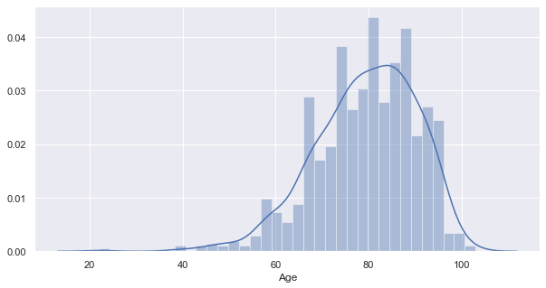
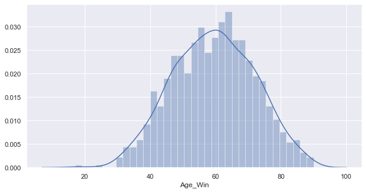
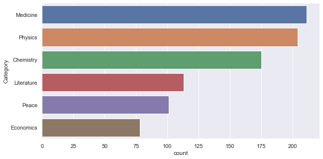
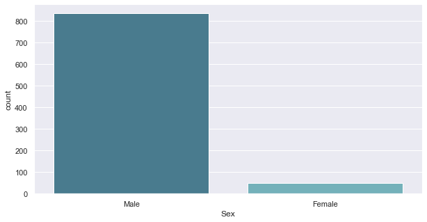
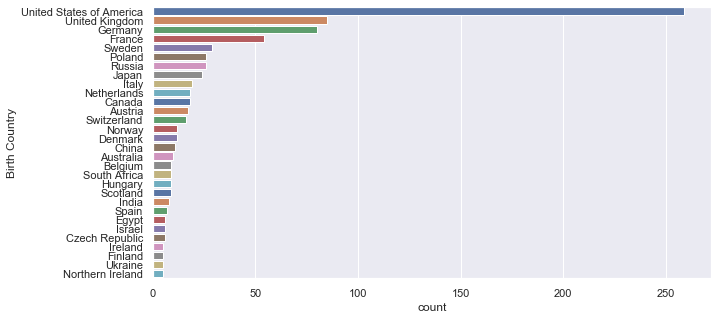
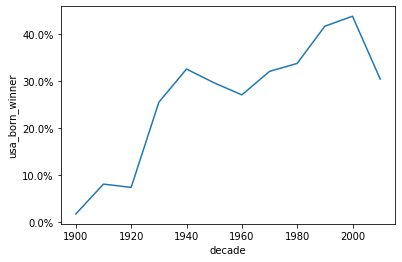
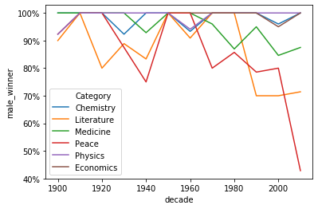
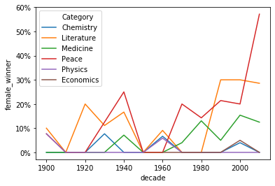
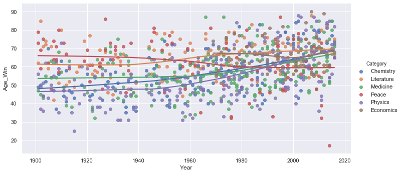

```python
import pandas as pd
import numpy as np
import scipy.stats as st
import xlrd 
import seaborn as sns
import matplotlib.pyplot as plt
import datetime
%matplotlib inline

data =pd.read_csv("data.csv") 
data= data.drop_duplicates(subset=['Full Name','Year','Laureate ID'])
data=data.replace({'Death Date':"alive"},value="11/26/2019",regex=True)
data=data.replace({'Death Date':"not found"},value="11/26/2019",regex=True)
data = data[data["Laureate Type"] != 'Organization']
#data=data[data["Laureate Type"]=='Organization']

data=data.reset_index(drop=True)

# data['year'] = data.DatetimeIndex(data['Birth Date']).year


data['Birth Year']= data["Birth Date"].str.extract("(\d{4})", expand=False)  
data['Death Year']= data["Death Date"].str.extract("(\d{4})", expand=False)  
data["Age"]=-data['Birth Year'].astype('int')+data["Death Year"].astype('int')
data["Age_Win"]=-data['Birth Year'].astype('int')+data["Year"].astype('int')
data.drop(['Death City', 'Death Country',"Birth Date","Death Date","Birth Year","Death Year","Motivation","Prize","Laureate Type"], axis = 1,inplace = True)
data.drop(['Unnamed: 18'], axis = 1,inplace = True)
data['Birth Country']= data['Birth Country'].str.replace(r'[^(]*\(|\)[^)]*', '')

d=data.groupby('Birth Country')["Organization Country"].apply(lambda x: st.mode(x)[0][0])
d=d[data['Birth Country']]
d_null=data['Organization Country'].isnull()
data.eq(0).any()
for i in range(0,data['Birth Country'].size):
    
    if(d_null[i]):
        # print("s")
        if(d[i]==0):
            data.iat[i,10] =data['Birth Country'][i] 
        else:
            data.iat[i,10] =d[i]

data.to_csv("new_data.csv")

data


```


<div>
<style scoped>
    .dataframe tbody tr th:only-of-type {
        vertical-align: middle;
    }

    .dataframe tbody tr th {
        vertical-align: top;
    }

    .dataframe thead th {
        text-align: right;
    }
</style>
<table border="1" class="dataframe">
  <thead>
    <tr style="text-align: right;">
      <th></th>
      <th>Year</th>
      <th>Category</th>
      <th>Prize Share</th>
      <th>Laureate ID</th>
      <th>Full Name</th>
      <th>Birth City</th>
      <th>Birth Country</th>
      <th>Sex</th>
      <th>Organization Name</th>
      <th>Organization City</th>
      <th>Organization Country</th>
      <th>Age</th>
      <th>Age_Win</th>
    </tr>
  </thead>
  <tbody>
    <tr>
      <td>0</td>
      <td>1901</td>
      <td>Chemistry</td>
      <td>1-Jan</td>
      <td>160</td>
      <td>Jacobus Henricus van 't Hoff</td>
      <td>Rotterdam</td>
      <td>Netherlands</td>
      <td>Male</td>
      <td>Berlin University</td>
      <td>Berlin</td>
      <td>Germany</td>
      <td>59</td>
      <td>49</td>
    </tr>
    <tr>
      <td>1</td>
      <td>1901</td>
      <td>Literature</td>
      <td>1-Jan</td>
      <td>569</td>
      <td>Sully Prudhomme</td>
      <td>Paris</td>
      <td>France</td>
      <td>Male</td>
      <td>NaN</td>
      <td>NaN</td>
      <td>France</td>
      <td>68</td>
      <td>62</td>
    </tr>
    <tr>
      <td>2</td>
      <td>1901</td>
      <td>Medicine</td>
      <td>1-Jan</td>
      <td>293</td>
      <td>Emil Adolf von Behring</td>
      <td>Hansdorf (Lawice)</td>
      <td>Poland</td>
      <td>Male</td>
      <td>Marburg University</td>
      <td>Marburg</td>
      <td>Germany</td>
      <td>63</td>
      <td>47</td>
    </tr>
    <tr>
      <td>3</td>
      <td>1901</td>
      <td>Peace</td>
      <td>2-Jan</td>
      <td>462</td>
      <td>Jean Henry Dunant</td>
      <td>Geneva</td>
      <td>Switzerland</td>
      <td>Male</td>
      <td>NaN</td>
      <td>NaN</td>
      <td>Switzerland</td>
      <td>82</td>
      <td>73</td>
    </tr>
    <tr>
      <td>4</td>
      <td>1901</td>
      <td>Peace</td>
      <td>2-Jan</td>
      <td>463</td>
      <td>Frédéric Passy</td>
      <td>Paris</td>
      <td>France</td>
      <td>Male</td>
      <td>NaN</td>
      <td>NaN</td>
      <td>France</td>
      <td>90</td>
      <td>79</td>
    </tr>
    <tr>
      <td>...</td>
      <td>...</td>
      <td>...</td>
      <td>...</td>
      <td>...</td>
      <td>...</td>
      <td>...</td>
      <td>...</td>
      <td>...</td>
      <td>...</td>
      <td>...</td>
      <td>...</td>
      <td>...</td>
      <td>...</td>
    </tr>
    <tr>
      <td>877</td>
      <td>2016</td>
      <td>Medicine</td>
      <td>1-Jan</td>
      <td>927</td>
      <td>Yoshinori Ohsumi</td>
      <td>Fukuoka</td>
      <td>Japan</td>
      <td>Male</td>
      <td>Tokyo Institute of Technology</td>
      <td>Tokyo</td>
      <td>Japan</td>
      <td>74</td>
      <td>71</td>
    </tr>
    <tr>
      <td>878</td>
      <td>2016</td>
      <td>Peace</td>
      <td>1-Jan</td>
      <td>934</td>
      <td>Juan Manuel Santos</td>
      <td>Bogotá</td>
      <td>Colombia</td>
      <td>Male</td>
      <td>NaN</td>
      <td>NaN</td>
      <td>Colombia</td>
      <td>68</td>
      <td>65</td>
    </tr>
    <tr>
      <td>879</td>
      <td>2016</td>
      <td>Physics</td>
      <td>2-Jan</td>
      <td>928</td>
      <td>David J. Thouless</td>
      <td>Bearsden</td>
      <td>United Kingdom</td>
      <td>Male</td>
      <td>University of Washington</td>
      <td>Seattle, WA</td>
      <td>United States of America</td>
      <td>85</td>
      <td>82</td>
    </tr>
    <tr>
      <td>880</td>
      <td>2016</td>
      <td>Physics</td>
      <td>4-Jan</td>
      <td>929</td>
      <td>F. Duncan M. Haldane</td>
      <td>London</td>
      <td>United Kingdom</td>
      <td>Male</td>
      <td>Princeton University</td>
      <td>Princeton, NJ</td>
      <td>United States of America</td>
      <td>68</td>
      <td>65</td>
    </tr>
    <tr>
      <td>881</td>
      <td>2016</td>
      <td>Physics</td>
      <td>4-Jan</td>
      <td>930</td>
      <td>J. Michael Kosterlitz</td>
      <td>Aberdeen</td>
      <td>United Kingdom</td>
      <td>Male</td>
      <td>Brown University</td>
      <td>Providence, RI</td>
      <td>United States of America</td>
      <td>76</td>
      <td>73</td>
    </tr>
  </tbody>
</table>
<p>882 rows × 13 columns</p>
</div>


 ### Statistics of the data


```python
data.describe()

```


<div>
<style scoped>
    .dataframe tbody tr th:only-of-type {
        vertical-align: middle;
    }

    .dataframe tbody tr th {
        vertical-align: top;
    }

    .dataframe thead th {
        text-align: right;
    }
</style>
<table border="1" class="dataframe">
  <thead>
    <tr style="text-align: right;">
      <th></th>
      <th>Year</th>
      <th>Laureate ID</th>
      <th>Age</th>
      <th>Age_Win</th>
    </tr>
  </thead>
  <tbody>
    <tr>
      <td>count</td>
      <td>882.000000</td>
      <td>882.000000</td>
      <td>882.000000</td>
      <td>882.000000</td>
    </tr>
    <tr>
      <td>mean</td>
      <td>1969.047619</td>
      <td>458.068027</td>
      <td>79.411565</td>
      <td>59.434240</td>
    </tr>
    <tr>
      <td>std</td>
      <td>32.894873</td>
      <td>272.309590</td>
      <td>10.911761</td>
      <td>12.403301</td>
    </tr>
    <tr>
      <td>min</td>
      <td>1901.000000</td>
      <td>1.000000</td>
      <td>22.000000</td>
      <td>17.000000</td>
    </tr>
    <tr>
      <td>25%</td>
      <td>1946.000000</td>
      <td>222.000000</td>
      <td>73.000000</td>
      <td>50.000000</td>
    </tr>
    <tr>
      <td>50%</td>
      <td>1975.000000</td>
      <td>442.500000</td>
      <td>80.000000</td>
      <td>60.000000</td>
    </tr>
    <tr>
      <td>75%</td>
      <td>1997.000000</td>
      <td>698.750000</td>
      <td>87.750000</td>
      <td>69.000000</td>
    </tr>
    <tr>
      <td>max</td>
      <td>2016.000000</td>
      <td>937.000000</td>
      <td>103.000000</td>
      <td>90.000000</td>
    </tr>
  </tbody>
</table>
</div>


### Current age distribution


```python
sns.distplot(data.Age, bins=35)
sns.set(rc={"figure.figsize": (10, 5)})
```





### The distribution of the age when the nobel prize was earned


```python
sns.distplot(data.Age_Win, bins=35)
sns.set(rc={"figure.figsize": (10, 5)})
```





### The distribution of the categories and their counts


```python
sns.countplot(y="Category", data=data,order=data.Category.value_counts().index,palette='deep')
sns.despine();
data['Category'].value_counts()
```


    Medicine      211
    Physics       204
    Chemistry     175
    Literature    113
    Peace         101
    Economics      78
    Name: Category, dtype: int64





### Gender Distribution 


```python
sns.countplot(x="Sex", data=data, palette='GnBu_d')
sns.despine();
data['Sex'].value_counts()
```


    Male      834
    Female     48
    Name: Sex, dtype: int64





### Organization Country Counts


```python
data['Organization Country'].value_counts()
```


    United States of America               404
    United Kingdom                         112
    France                                  58
    Germany                                 58
    Sweden                                  30
    Switzerland                             26
    Federal Republic of Germany             23
    Japan                                   19
    Union of Soviet Socialist Republics     16
    Denmark                                 13
    Netherlands                             12
    Belgium                                  9
    Austria                                  9
    Norway                                   9
    Italy                                    7
    Canada                                   7
    Spain                                    6
    Israel                                   6
    Australia                                5
    Northern Ireland                         5
    Russia                                   5
    Ireland                                  4
    Finland                                  3
    Portugal                                 2
    Chile                                    2
    Guatemala                                2
    Iran                                     2
    Liberia                                  2
    Colombia                                 2
    Argentina                                2
    East Timor                               2
    Trinidad                                 1
    Czechoslovakia                           1
    Costa Rica                               1
    Guadeloupe Island                        1
    India                                    1
    Iceland                                  1
    Nigeria                                  1
    Zimbabwe                                 1
    China                                    1
    Hungary                                  1
    Yemen                                    1
    Greece                                   1
    Peru                                     1
    Madagascar                               1
    Alsace (then Germany, now France)        1
    Bulgaria                                 1
    Bangladesh                               1
    Kenya                                    1
    Myanmar                                  1
    Ghana                                    1
    Name: Organization Country, dtype: int64


### Organization Country Distribution 


```python
data['usa_born_winner'] = data['Birth Country']=="United States of America"
data['decade'] = (np.floor(data['Year']/10)*10).astype(int)
prop_usa_winners = data.groupby('decade',as_index=False)['usa_born_winner'].mean()

# Display the proportions of USA born winners per decade
display(prop_usa_winners)

```


<div>
<style scoped>
    .dataframe tbody tr th:only-of-type {
        vertical-align: middle;
    }

    .dataframe tbody tr th {
        vertical-align: top;
    }

    .dataframe thead th {
        text-align: right;
    }
</style>
<table border="1" class="dataframe">
  <thead>
    <tr style="text-align: right;">
      <th></th>
      <th>decade</th>
      <th>usa_born_winner</th>
    </tr>
  </thead>
  <tbody>
    <tr>
      <td>0</td>
      <td>1900</td>
      <td>0.017857</td>
    </tr>
    <tr>
      <td>1</td>
      <td>1910</td>
      <td>0.078947</td>
    </tr>
    <tr>
      <td>2</td>
      <td>1920</td>
      <td>0.074074</td>
    </tr>
    <tr>
      <td>3</td>
      <td>1930</td>
      <td>0.254545</td>
    </tr>
    <tr>
      <td>4</td>
      <td>1940</td>
      <td>0.325000</td>
    </tr>
    <tr>
      <td>5</td>
      <td>1950</td>
      <td>0.295775</td>
    </tr>
    <tr>
      <td>6</td>
      <td>1960</td>
      <td>0.280000</td>
    </tr>
    <tr>
      <td>7</td>
      <td>1970</td>
      <td>0.326733</td>
    </tr>
    <tr>
      <td>8</td>
      <td>1980</td>
      <td>0.333333</td>
    </tr>
    <tr>
      <td>9</td>
      <td>1990</td>
      <td>0.415842</td>
    </tr>
    <tr>
      <td>10</td>
      <td>2000</td>
      <td>0.436975</td>
    </tr>
    <tr>
      <td>11</td>
      <td>2010</td>
      <td>0.303797</td>
    </tr>
  </tbody>
</table>
</div>


### Birth Country Distribution


```python
sns.countplot(y="Birth Country", data=data,order=data["Birth Country"].value_counts().head(30).index,palette='deep')
sns.set(rc={"figure.figsize": (15, 12)})
```





### Corelation analysis between the organization country and the category


```python
contengency_table = pd.crosstab(data["Category"],data["Organization Country"], margins= False)
contengency_table
```


<div>
<style scoped>
    .dataframe tbody tr th:only-of-type {
        vertical-align: middle;
    }

    .dataframe tbody tr th {
        vertical-align: top;
    }

    .dataframe thead th {
        text-align: right;
    }
</style>
<table border="1" class="dataframe">
  <thead>
    <tr style="text-align: right;">
      <th>Organization Country</th>
      <th>Alsace (then Germany, now France)</th>
      <th>Argentina</th>
      <th>Australia</th>
      <th>Austria</th>
      <th>Bangladesh</th>
      <th>Belgium</th>
      <th>Bulgaria</th>
      <th>Canada</th>
      <th>Chile</th>
      <th>China</th>
      <th>...</th>
      <th>Russia</th>
      <th>Spain</th>
      <th>Sweden</th>
      <th>Switzerland</th>
      <th>Trinidad</th>
      <th>Union of Soviet Socialist Republics</th>
      <th>United Kingdom</th>
      <th>United States of America</th>
      <th>Yemen</th>
      <th>Zimbabwe</th>
    </tr>
    <tr>
      <th>Category</th>
      <th></th>
      <th></th>
      <th></th>
      <th></th>
      <th></th>
      <th></th>
      <th></th>
      <th></th>
      <th></th>
      <th></th>
      <th></th>
      <th></th>
      <th></th>
      <th></th>
      <th></th>
      <th></th>
      <th></th>
      <th></th>
      <th></th>
      <th></th>
      <th></th>
    </tr>
  </thead>
  <tbody>
    <tr>
      <td>Chemistry</td>
      <td>0</td>
      <td>1</td>
      <td>0</td>
      <td>1</td>
      <td>0</td>
      <td>1</td>
      <td>0</td>
      <td>3</td>
      <td>0</td>
      <td>0</td>
      <td>...</td>
      <td>0</td>
      <td>0</td>
      <td>5</td>
      <td>6</td>
      <td>0</td>
      <td>1</td>
      <td>27</td>
      <td>74</td>
      <td>0</td>
      <td>0</td>
    </tr>
    <tr>
      <td>Economics</td>
      <td>0</td>
      <td>0</td>
      <td>0</td>
      <td>1</td>
      <td>0</td>
      <td>0</td>
      <td>0</td>
      <td>0</td>
      <td>0</td>
      <td>0</td>
      <td>...</td>
      <td>0</td>
      <td>0</td>
      <td>2</td>
      <td>0</td>
      <td>0</td>
      <td>1</td>
      <td>6</td>
      <td>61</td>
      <td>0</td>
      <td>0</td>
    </tr>
    <tr>
      <td>Literature</td>
      <td>0</td>
      <td>0</td>
      <td>0</td>
      <td>1</td>
      <td>0</td>
      <td>1</td>
      <td>1</td>
      <td>0</td>
      <td>2</td>
      <td>0</td>
      <td>...</td>
      <td>0</td>
      <td>5</td>
      <td>7</td>
      <td>2</td>
      <td>1</td>
      <td>5</td>
      <td>10</td>
      <td>34</td>
      <td>0</td>
      <td>0</td>
    </tr>
    <tr>
      <td>Medicine</td>
      <td>0</td>
      <td>1</td>
      <td>4</td>
      <td>4</td>
      <td>0</td>
      <td>3</td>
      <td>0</td>
      <td>2</td>
      <td>0</td>
      <td>1</td>
      <td>...</td>
      <td>1</td>
      <td>1</td>
      <td>7</td>
      <td>8</td>
      <td>0</td>
      <td>0</td>
      <td>31</td>
      <td>106</td>
      <td>0</td>
      <td>0</td>
    </tr>
    <tr>
      <td>Peace</td>
      <td>0</td>
      <td>0</td>
      <td>0</td>
      <td>1</td>
      <td>1</td>
      <td>3</td>
      <td>0</td>
      <td>0</td>
      <td>0</td>
      <td>0</td>
      <td>...</td>
      <td>2</td>
      <td>0</td>
      <td>5</td>
      <td>3</td>
      <td>0</td>
      <td>2</td>
      <td>13</td>
      <td>30</td>
      <td>1</td>
      <td>1</td>
    </tr>
    <tr>
      <td>Physics</td>
      <td>1</td>
      <td>0</td>
      <td>1</td>
      <td>1</td>
      <td>0</td>
      <td>1</td>
      <td>0</td>
      <td>2</td>
      <td>0</td>
      <td>0</td>
      <td>...</td>
      <td>2</td>
      <td>0</td>
      <td>4</td>
      <td>7</td>
      <td>0</td>
      <td>7</td>
      <td>25</td>
      <td>99</td>
      <td>0</td>
      <td>0</td>
    </tr>
  </tbody>
</table>
<p>6 rows × 51 columns</p>
</div>


#### From the above table it is shown that the USA is top country in all the categories followed by the UK 


```python
st.chi2_contingency(contengency_table)
```


    (427.120836467145,
     2.0214273961934947e-11,
     250,
     array([[1.98412698e-01, 3.96825397e-01, 9.92063492e-01, 1.78571429e+00,
             1.98412698e-01, 1.78571429e+00, 1.98412698e-01, 1.38888889e+00,
             3.96825397e-01, 1.98412698e-01, 3.96825397e-01, 1.98412698e-01,
             1.98412698e-01, 2.57936508e+00, 3.96825397e-01, 4.56349206e+00,
             5.95238095e-01, 1.15079365e+01, 1.15079365e+01, 1.98412698e-01,
             1.98412698e-01, 1.98412698e-01, 3.96825397e-01, 1.98412698e-01,
             1.98412698e-01, 1.98412698e-01, 3.96825397e-01, 7.93650794e-01,
             1.19047619e+00, 1.38888889e+00, 3.76984127e+00, 1.98412698e-01,
             3.96825397e-01, 1.98412698e-01, 1.98412698e-01, 2.38095238e+00,
             1.98412698e-01, 9.92063492e-01, 1.78571429e+00, 1.98412698e-01,
             3.96825397e-01, 9.92063492e-01, 1.19047619e+00, 5.95238095e+00,
             5.15873016e+00, 1.98412698e-01, 3.17460317e+00, 2.22222222e+01,
             8.01587302e+01, 1.98412698e-01, 1.98412698e-01],
            [8.84353741e-02, 1.76870748e-01, 4.42176871e-01, 7.95918367e-01,
             8.84353741e-02, 7.95918367e-01, 8.84353741e-02, 6.19047619e-01,
             1.76870748e-01, 8.84353741e-02, 1.76870748e-01, 8.84353741e-02,
             8.84353741e-02, 1.14965986e+00, 1.76870748e-01, 2.03401361e+00,
             2.65306122e-01, 5.12925170e+00, 5.12925170e+00, 8.84353741e-02,
             8.84353741e-02, 8.84353741e-02, 1.76870748e-01, 8.84353741e-02,
             8.84353741e-02, 8.84353741e-02, 1.76870748e-01, 3.53741497e-01,
             5.30612245e-01, 6.19047619e-01, 1.68027211e+00, 8.84353741e-02,
             1.76870748e-01, 8.84353741e-02, 8.84353741e-02, 1.06122449e+00,
             8.84353741e-02, 4.42176871e-01, 7.95918367e-01, 8.84353741e-02,
             1.76870748e-01, 4.42176871e-01, 5.30612245e-01, 2.65306122e+00,
             2.29931973e+00, 8.84353741e-02, 1.41496599e+00, 9.90476190e+00,
             3.57278912e+01, 8.84353741e-02, 8.84353741e-02],
            [1.28117914e-01, 2.56235828e-01, 6.40589569e-01, 1.15306122e+00,
             1.28117914e-01, 1.15306122e+00, 1.28117914e-01, 8.96825397e-01,
             2.56235828e-01, 1.28117914e-01, 2.56235828e-01, 1.28117914e-01,
             1.28117914e-01, 1.66553288e+00, 2.56235828e-01, 2.94671202e+00,
             3.84353741e-01, 7.43083900e+00, 7.43083900e+00, 1.28117914e-01,
             1.28117914e-01, 1.28117914e-01, 2.56235828e-01, 1.28117914e-01,
             1.28117914e-01, 1.28117914e-01, 2.56235828e-01, 5.12471655e-01,
             7.68707483e-01, 8.96825397e-01, 2.43424036e+00, 1.28117914e-01,
             2.56235828e-01, 1.28117914e-01, 1.28117914e-01, 1.53741497e+00,
             1.28117914e-01, 6.40589569e-01, 1.15306122e+00, 1.28117914e-01,
             2.56235828e-01, 6.40589569e-01, 7.68707483e-01, 3.84353741e+00,
             3.33106576e+00, 1.28117914e-01, 2.04988662e+00, 1.43492063e+01,
             5.17596372e+01, 1.28117914e-01, 1.28117914e-01],
            [2.39229025e-01, 4.78458050e-01, 1.19614512e+00, 2.15306122e+00,
             2.39229025e-01, 2.15306122e+00, 2.39229025e-01, 1.67460317e+00,
             4.78458050e-01, 2.39229025e-01, 4.78458050e-01, 2.39229025e-01,
             2.39229025e-01, 3.10997732e+00, 4.78458050e-01, 5.50226757e+00,
             7.17687075e-01, 1.38752834e+01, 1.38752834e+01, 2.39229025e-01,
             2.39229025e-01, 2.39229025e-01, 4.78458050e-01, 2.39229025e-01,
             2.39229025e-01, 2.39229025e-01, 4.78458050e-01, 9.56916100e-01,
             1.43537415e+00, 1.67460317e+00, 4.54535147e+00, 2.39229025e-01,
             4.78458050e-01, 2.39229025e-01, 2.39229025e-01, 2.87074830e+00,
             2.39229025e-01, 1.19614512e+00, 2.15306122e+00, 2.39229025e-01,
             4.78458050e-01, 1.19614512e+00, 1.43537415e+00, 7.17687075e+00,
             6.21995465e+00, 2.39229025e-01, 3.82766440e+00, 2.67936508e+01,
             9.66485261e+01, 2.39229025e-01, 2.39229025e-01],
            [1.14512472e-01, 2.29024943e-01, 5.72562358e-01, 1.03061224e+00,
             1.14512472e-01, 1.03061224e+00, 1.14512472e-01, 8.01587302e-01,
             2.29024943e-01, 1.14512472e-01, 2.29024943e-01, 1.14512472e-01,
             1.14512472e-01, 1.48866213e+00, 2.29024943e-01, 2.63378685e+00,
             3.43537415e-01, 6.64172336e+00, 6.64172336e+00, 1.14512472e-01,
             1.14512472e-01, 1.14512472e-01, 2.29024943e-01, 1.14512472e-01,
             1.14512472e-01, 1.14512472e-01, 2.29024943e-01, 4.58049887e-01,
             6.87074830e-01, 8.01587302e-01, 2.17573696e+00, 1.14512472e-01,
             2.29024943e-01, 1.14512472e-01, 1.14512472e-01, 1.37414966e+00,
             1.14512472e-01, 5.72562358e-01, 1.03061224e+00, 1.14512472e-01,
             2.29024943e-01, 5.72562358e-01, 6.87074830e-01, 3.43537415e+00,
             2.97732426e+00, 1.14512472e-01, 1.83219955e+00, 1.28253968e+01,
             4.62630385e+01, 1.14512472e-01, 1.14512472e-01],
            [2.31292517e-01, 4.62585034e-01, 1.15646259e+00, 2.08163265e+00,
             2.31292517e-01, 2.08163265e+00, 2.31292517e-01, 1.61904762e+00,
             4.62585034e-01, 2.31292517e-01, 4.62585034e-01, 2.31292517e-01,
             2.31292517e-01, 3.00680272e+00, 4.62585034e-01, 5.31972789e+00,
             6.93877551e-01, 1.34149660e+01, 1.34149660e+01, 2.31292517e-01,
             2.31292517e-01, 2.31292517e-01, 4.62585034e-01, 2.31292517e-01,
             2.31292517e-01, 2.31292517e-01, 4.62585034e-01, 9.25170068e-01,
             1.38775510e+00, 1.61904762e+00, 4.39455782e+00, 2.31292517e-01,
             4.62585034e-01, 2.31292517e-01, 2.31292517e-01, 2.77551020e+00,
             2.31292517e-01, 1.15646259e+00, 2.08163265e+00, 2.31292517e-01,
             4.62585034e-01, 1.15646259e+00, 1.38775510e+00, 6.93877551e+00,
             6.01360544e+00, 2.31292517e-01, 3.70068027e+00, 2.59047619e+01,
             9.34421769e+01, 2.31292517e-01, 2.31292517e-01]]))


- p-value = 1.773631129090637e-10 which is <0.05 the hypothesis is rejected.
- So the attributes are corelated. In other word there is a relation between the organization country and the category 

### USA - Prize Proportion per Decade


```python
# Plotting USA born winners 
ax = sns.lineplot(data=prop_usa_winners, x='decade',y='usa_born_winner')

# Adding %-formatting to the y-axis
from matplotlib.ticker import PercentFormatter
ax.yaxis.set_major_formatter(PercentFormatter(1.0))
```





### Male Winners per Decade


```python
data['male_winner'] = np.where(data['Sex']=="Male", True, False)

prop_male_winners = data.groupby(['decade','Category'],as_index=False)['male_winner'].mean()


ax = sns.lineplot(x='decade', y='male_winner', hue='Category', data=prop_male_winners)
ax.yaxis.set_major_formatter(PercentFormatter(1.0))


```





### Female Prize winners by decade


```python
data['female_winner'] = np.where(data['Sex']=="Female", True, False)

prop_female_winners = data.groupby(['decade','Category'],as_index=False)['female_winner'].mean()


ax = sns.lineplot(x='decade', y='female_winner', hue='Category', data=prop_female_winners)
ax.yaxis.set_major_formatter(PercentFormatter(1.0))
```





### Nobel Category vs Age of Prize Winners


```python
sns.lmplot('Year','Age_Win',data=data,lowess=True, aspect=2, hue='Category')
```





### People who won nobel prize more than once 


```python
data.groupby("Full Name").filter(lambda x: len(x) >= 2)['Full Name'].value_counts()
```


    John Bardeen                   2
    Frederick Sanger               2
    Linus Carl Pauling             2
    Marie Curie, née Sklodowska    2
    Name: Full Name, dtype: int64


### Nobel Category vs Age of Prize Winners


```python
sns.lmplot('Year','Age_Win',data=data,lowess=True, aspect=2, hue='Category')
```


#### Acording to the previous statistics:
#### The mean age for winning a nobel rize is 59 
#### Medicin is the top category in which nobel prize is won
#### USA is the top country from which nobel prize winners come from either born there or belong to an organization there
#### Nobel prize winners are mosly males 


